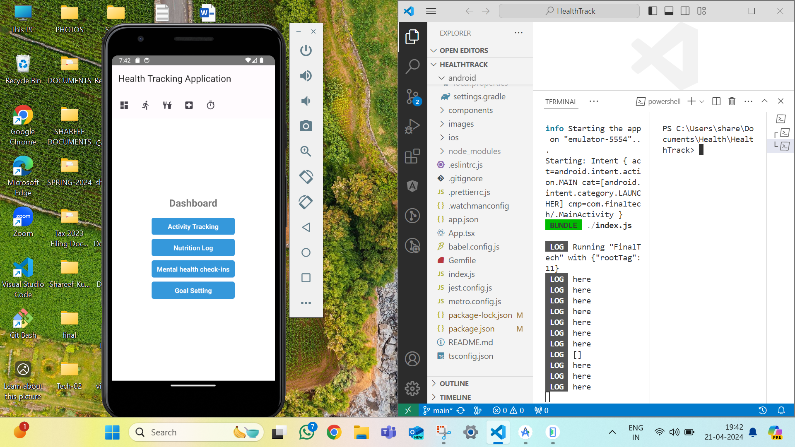
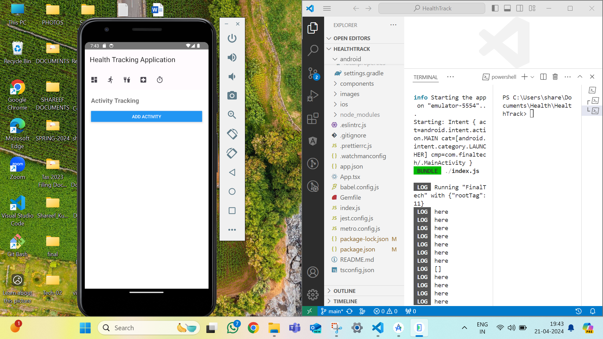
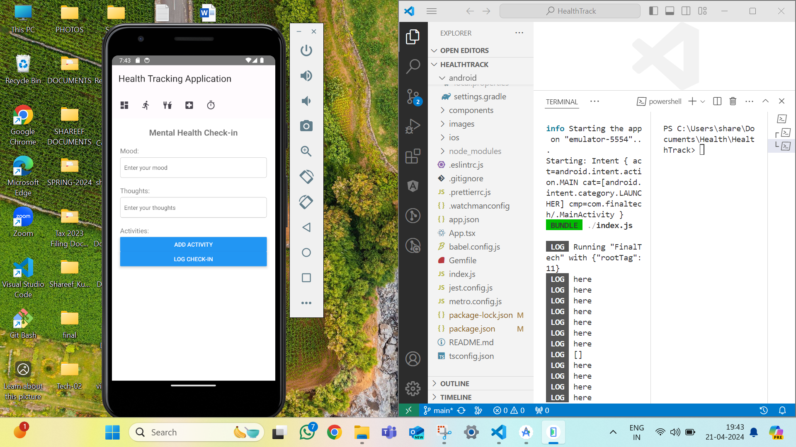
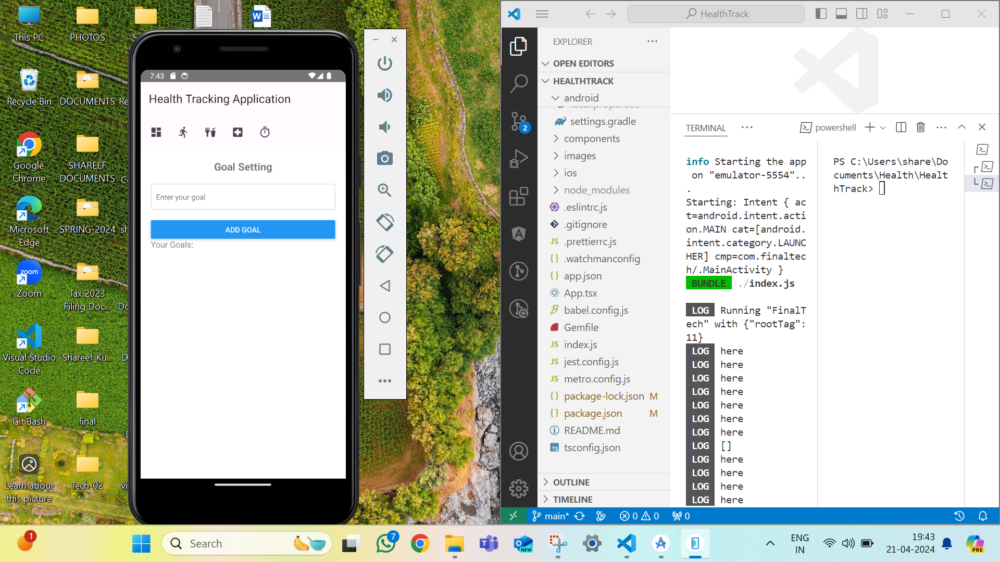
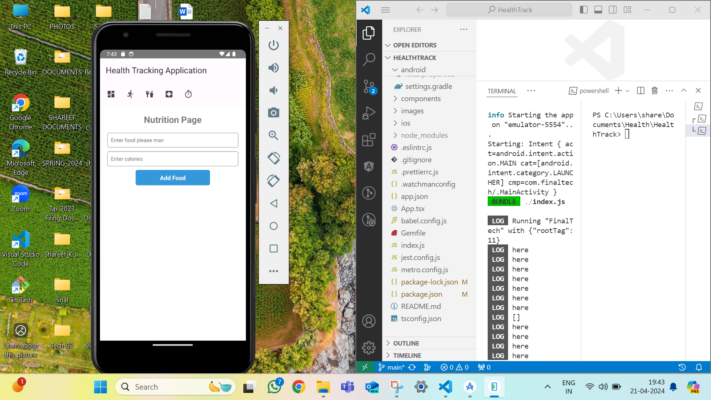

# HealthTrack
This app is designed to help users track their fitness activities, meals, health and goals.

## Features

- **Dashboard**: Provides an overview of activity summary, motivational codes, and navigation to other sections.
- **Activity Log**: Allows users to track daily activities, meals, diets, and view monthly activity trends.
- **Mental health check-in**: Enables users to monitor daily mood and thoughts.
- **Goals and Achievements**: Helps users set and track daily, monthly goals, and view achieved goals.
- **Nutrition page**: Track food and colories consumed.

## Technologies Used

- React Native: Frontend framework for building cross-platform mobile apps.
- Redux: State management library for managing application state.
- React Navigation: Library for navigation between screens in React Native apps.
- Chart.js: JavaScript charting library for rendering graphs and charts.

## Getting Started

To get started with the app, follow these steps:

Run the app on Android or iOS:
   - Android: `npx react-native run-android`
   - iOS: `npx react-native run-ios`

Note: Run the code when the Mobile Phone is connected to the laptop with the USB Debugging is turned on.

